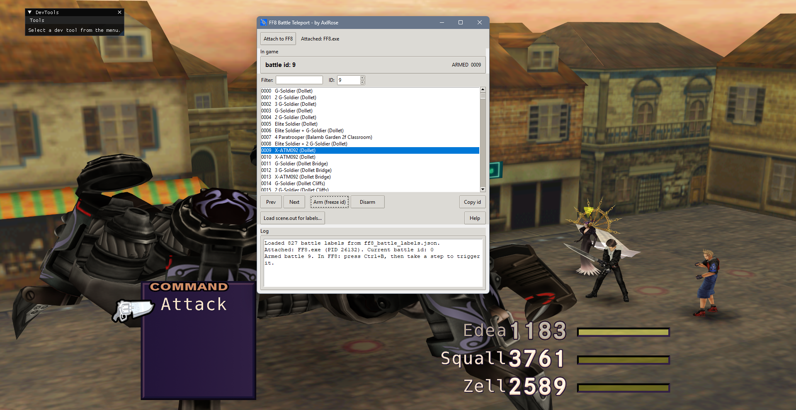

# FF8 Battle Teleport

FF8 Battle Teleport lets you jump straight into any battle in Final Fantasy VIII. Pick a battle from the list, arm it, trigger a battle in the game, and you land right in the one you picked. It's made for modders who need to test something in a specific battle, like battle music, sound effects, voices, enemy models or battle backgrounds, without playing up to that point or hunting for the right encounter.

Every battle id from 0000 to 1023 is listed, most of them with a readable name like "0009 X-ATM092 (Dollet)", so you don't have to look ids up anywhere else. You can filter the list, step through battles with Prev and Next, and copy an id. If you load the game's `scene.out`, it also shows the enemy models (c0m files) in each battle.

It's a testing tool for modders, not a trainer. The only thing it changes in the game's memory is the id of the next battle, and only while a battle is armed. Disarm it and encounters go back to normal.

It has been tested with FFNx and the Junction VIII mod manager, on Final Fantasy VIII Remastered and the original 2013 Steam version, and with Final Fantasy VIII Remastered launched on its own, without Junction VIII. Those are the only setups it supports.

## Download

Get `ff8_battle_moment.zip` from the [latest release](https://github.com/AxlRose-RX/FF8-Battle-Teleport/releases/latest), unzip it anywhere and run `ff8_battle_moment.exe`. Keep the `_internal` folder next to the .exe.

Because it writes to the game's memory, some antivirus programs may flag it. The full source is here if you want to check it or build it yourself.

## How to use

1. Start the game through Junction VIII (or just launch the Remastered version on its own) and load a save.
2. Click **Attach to FF8**.
3. Pick a battle and click **Arm (freeze id)**, or double-click it.
4. In the game, press **Ctrl+B** (FFNx force battle), then take a step on a field or walk around on the world map. On the Remastered version without Junction VIII there's no Ctrl+B, so just walk around until a random battle starts. The battle you armed loads.
5. Pick another battle and trigger again, or click **Disarm** to stop.

## Build it yourself

Download **Source code (zip)** from any release, install [Python 3](https://www.python.org/downloads/) and double-click `build_exeonedir.bat`. It installs everything it needs and builds the app into `dist\ff8_battle_moment`.

## Credits

Made by AxlRose. Claude (Anthropic's AI) helped write the code. [TrueOdin](https://github.com/julianxhokaxhiu) added support for the Remastered version without Junction VIII. Battle names come from the Battle Ambience sheet by [mikedoesaudio](https://github.com/MikeHolmesAudio).

Questions and bug reports: [Tsunamods Discord](https://discord.com/invite/7Rsvsewghz)
